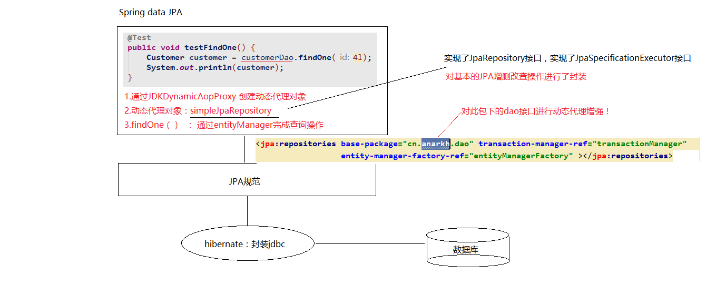

> Spring Data Jpa使用总结

### 一、增删改查

#### 1、查询

- 1.`find(Entity.class,id)`:
  - 查询的对象就是当前客户对象本身
  - 在调用find方法的时候，就会发送sql语句查询数据库
  - 立即加载
- 2.`getReference(Entity.class,id)`:（用的比较多）
  - 获取的对象是一个动态代理对象
  - 调用getReference方法不会立即发送sql语句查询数据库
    - 当调用查询结果对象的时候，才会发送查询的sql语句：什么时候用，什么时候发送sql语句查询数据库。
  - 延迟加载（懒加载）
    - 得到的是一个动态代理对象
    - 什么时候用，什么时候查询

#### 2、删除

- `remove(Object obj)`：删除前必须用find方法查出来。

#### 3、保存

- `persist(Object obj)`

#### 4、更新

- `merge(Object obj)`

```java
package cn.anarkh.utils;

import javax.persistence.EntityManager;
import javax.persistence.EntityManagerFactory;
import javax.persistence.Persistence;

/**
 * 解决实体管理器工厂的浪费资源和耗时问题
 *      通过静态代码块的形式，当程序第一次访问此工具类时，创建一个公共的实体管理器工厂对象
 *
 * 第一次访问getEntityManager方法：经过静态代码块创建一个factory对象，再调用方法创建一个EntityManager对象
 * 第二次方法getEntityManager方法：直接通过一个已经创建好的factory对象，创建EntityManager对象
 */
public class JpaUtils {

    private static EntityManagerFactory factory;

    static  {
        //1.加载配置文件，创建entityManagerFactory
        factory = Persistence.createEntityManagerFactory("myJpa");
    }

    /**
     * 获取EntityManager对象
     */
    public static EntityManager getEntityManager() {
       return factory.createEntityManager();
    }
}

```

```java
package cn.anarkh.test;

import cn.anarkh.domain.Customer;
import cn.anarkh.utils.JpaUtils;
import org.junit.Test;

import javax.persistence.EntityManager;
import javax.persistence.EntityManagerFactory;
import javax.persistence.EntityTransaction;
import javax.persistence.Persistence;

public class JpaTest {

    /**
     * 测试jpa的保存
     *      案例：保存一个客户到数据库中
     *  Jpa的操作步骤
     *     1.加载配置文件创建工厂（实体管理器工厂）对象
     *     2.通过实体管理器工厂获取实体管理器
     *     3.获取事务对象，开启事务
     *     4.完成增删改查操作
     *     5.提交事务（回滚事务）
     *     6.释放资源
     */
    @Test
    public void testSave() {
//        //1.加载配置文件创建工厂（实体管理器工厂）对象
//        EntityManagerFactory factory = Persistence.createEntityManagerFactory("myJpa");
//        //2.通过实体管理器工厂获取实体管理器
//        EntityManager em = factory.createEntityManager();
        EntityManager em = JpaUtils.getEntityManager();
        //3.获取事务对象，开启事务
        EntityTransaction tx = em.getTransaction(); //获取事务对象
        tx.begin();//开启事务
        //4.完成增删改查操作：保存一个客户到数据库中
        Customer customer = new Customer();
        customer.setCustName("anarkh");
        customer.setCustIndustry("软件");
        //保存，
        em.persist(customer); //保存操作
        //5.提交事务
        tx.commit();
        //6.释放资源
        em.close();
 //       factory.close();

    }

    /**
     * 根据id查询客户
     *  使用find方法查询：
     *      1.查询的对象就是当前客户对象本身
     *      2.在调用find方法的时候，就会发送sql语句查询数据库
     *
     *  立即加载
     *
     *
     */
    @Test
    public  void testFind() {
        //1.通过工具类获取entityManager
        EntityManager entityManager = JpaUtils.getEntityManager();
        //2.开启事务
        EntityTransaction tx = entityManager.getTransaction();
        tx.begin();
        //3.增删改查 -- 根据id查询客户
        /**
         * find : 根据id查询数据
         *      class：查询数据的结果需要包装的实体类类型的字节码
         *      id：查询的主键的取值
         */
        Customer customer = entityManager.find(Customer.class, 1l);
       // System.out.print(customer);
        //4.提交事务
        tx.commit();
        //5.释放资源
        entityManager.close();
    }

    /**
     * 根据id查询客户
     *      getReference方法
     *          1.获取的对象是一个动态代理对象
     *          2.调用getReference方法不会立即发送sql语句查询数据库
     *              * 当调用查询结果对象的时候，才会发送查询的sql语句：什么时候用，什么时候发送sql语句查询数据库
     *
     * 延迟加载（懒加载）
     *      * 得到的是一个动态代理对象
     *      * 什么时候用，什么使用才会查询
     */
    @Test
    public  void testReference() {
        //1.通过工具类获取entityManager
        EntityManager entityManager = JpaUtils.getEntityManager();
        //2.开启事务
        EntityTransaction tx = entityManager.getTransaction();
        tx.begin();
        //3.增删改查 -- 根据id查询客户
        /**
         * getReference : 根据id查询数据
         *      class：查询数据的结果需要包装的实体类类型的字节码
         *      id：查询的主键的取值
         */
        Customer customer = entityManager.getReference(Customer.class, 1l);
        System.out.print(customer);
        //4.提交事务
        tx.commit();
        //5.释放资源
        entityManager.close();
    }


    /**
     * 删除客户的案例
     *
     */
    @Test
    public  void testRemove() {
        //1.通过工具类获取entityManager
        EntityManager entityManager = JpaUtils.getEntityManager();
        //2.开启事务
        EntityTransaction tx = entityManager.getTransaction();
        tx.begin();
        //3.增删改查 -- 删除客户

        //i 根据id查询客户
        Customer customer = entityManager.find(Customer.class,1l);
        //ii 调用remove方法完成删除操作
        entityManager.remove(customer);

        //4.提交事务
        tx.commit();
        //5.释放资源
        entityManager.close();
    }


    /**
     * 更新客户的操作
     *      merge(Object)
     */
    @Test
    public  void testUpdate() {
        //1.通过工具类获取entityManager
        EntityManager entityManager = JpaUtils.getEntityManager();
        //2.开启事务
        EntityTransaction tx = entityManager.getTransaction();
        tx.begin();
        //3.增删改查 -- 更新操作

        //i 查询客户
        Customer customer = entityManager.find(Customer.class,1l);
        //ii 更新客户
        customer.setCustIndustry("it软件");
        entityManager.merge(customer);

        //4.提交事务
        tx.commit();
        //5.释放资源
        entityManager.close();
    }

}

```


### 二、JPQL查询

```java
package cn.anarkh.test;

import cn.anarkh.domain.Customer;
import cn.anarkh.utils.JpaUtils;
import org.junit.Test;

import javax.persistence.EntityManager;
import javax.persistence.EntityTransaction;
import javax.persistence.Query;
import java.util.List;

/**
 * 测试jqpl查询
 */
public class JpqlTest {

    /**
     * 查询全部
     *      jqpl：from cn.anarkh.domain.Customer
     *      sql：SELECT * FROM cst_customer
     */
    @Test
    public void testFindAll() {
        //1.获取entityManager对象
        EntityManager em = JpaUtils.getEntityManager();
        //2.开启事务
        EntityTransaction tx = em.getTransaction();
        tx.begin();
        //3.查询全部
        String jpql = "from Customer ";
        Query query = em.createQuery(jpql);//创建Query查询对象，query对象才是执行jqpl的对象
        //StringBuilder jpql = new StringBuilder("from Customer");
        //Query query = em.createQuery(jpql.toString());
        
        //发送查询，并封装结果集
        List list = query.getResultList();

        for (Object obj : list) {
            System.out.print(obj);
        }

        //4.提交事务
        tx.commit();
        //5.释放资源
        em.close();
    }


    /**
     * 排序查询： 倒序查询全部客户（根据id倒序）
     *      sql：SELECT * FROM cst_customer ORDER BY cust_id DESC
     *      jpql：from Customer order by custId desc
     *
     * 进行jpql查询
     *      1.创建query查询对象
     *      2.对参数进行赋值
     *      3.查询，并得到返回结果
     */
    @Test
    public void testOrders() {
        //1.获取entityManager对象
        EntityManager em = JpaUtils.getEntityManager();
        //2.开启事务
        EntityTransaction tx = em.getTransaction();
        tx.begin();
        //3.查询全部
        String jpql = "from Customer order by custId desc";
        Query query = em.createQuery(jpql);//创建Query查询对象，query对象才是执行jqpl的对象

        //发送查询，并封装结果集
        List list = query.getResultList();

        for (Object obj : list) {
            System.out.println(obj);
        }

        //4.提交事务
        tx.commit();
        //5.释放资源
        em.close();
    }


    /**
     * 使用jpql查询，统计客户的总数
     *      sql：SELECT COUNT(cust_id) FROM cst_customer
     *      jpql：select count(custId) from Customer
     */
    @Test
    public void testCount() {
        //1.获取entityManager对象
        EntityManager em = JpaUtils.getEntityManager();
        //2.开启事务
        EntityTransaction tx = em.getTransaction();
        tx.begin();
        //3.查询全部
        //i.根据jpql语句创建Query查询对象
        String jpql = "select count(custId) from Customer";
        Query query = em.createQuery(jpql);
        //ii.对参数赋值
        //iii.发送查询，并封装结果

        /**
         * getResultList ： 直接将查询结果封装为list集合
         * getSingleResult : 得到唯一的结果集
         */
        Object result = query.getSingleResult();

        System.out.println(result);

        //4.提交事务
        tx.commit();
        //5.释放资源
        em.close();
    }


    /**
     * 分页查询
     *      sql：select * from cst_customer limit 0,2
     *      jqpl : from Customer
     */
    @Test
    public void testPaged() {
        //1.获取entityManager对象
        EntityManager em = JpaUtils.getEntityManager();
        //2.开启事务
        EntityTransaction tx = em.getTransaction();
        tx.begin();
        //3.查询全部
        //i.根据jpql语句创建Query查询对象
        String jpql = "from Customer";
        Query query = em.createQuery(jpql);
        //ii.对参数赋值 -- 分页参数
        //起始索引
        query.setFirstResult(0);
        //每页查询的条数
        query.setMaxResults(2);

        //iii.发送查询，并封装结果

        /**
         * getResultList ： 直接将查询结果封装为list集合
         * getSingleResult : 得到唯一的结果集
         */
        List list = query.getResultList();

        for(Object obj : list) {
            System.out.println(obj);
        }

        //4.提交事务
        tx.commit();
        //5.释放资源
        em.close();
    }


    /**
     * 条件查询
     *     案例：查询客户名称以‘anarkh’开头的客户
     *          sql：SELECT * FROM cst_customer WHERE cust_name LIKE  ?
     *          jpql : from Customer where custName like ?
     */
    @Test
    public void testCondition() {
        //1.获取entityManager对象
        EntityManager em = JpaUtils.getEntityManager();
        //2.开启事务
        EntityTransaction tx = em.getTransaction();
        tx.begin();
        //3.查询全部
        //i.根据jpql语句创建Query查询对象
        String jpql = "from Customer where custName like ? ";
        Query query = em.createQuery(jpql);
        //ii.对参数赋值 -- 占位符参数
        //第一个参数：占位符的索引位置（从1开始），第二个参数：取值
        query.setParameter(1,"anarkh%");

        //iii.发送查询，并封装结果

        /**
         * getResultList ： 直接将查询结果封装为list集合
         * getSingleResult : 得到唯一的结果集
         */
        List list = query.getResultList();

        for(Object obj : list) {
            System.out.println(obj);
        }

        //4.提交事务
        tx.commit();
        //5.释放资源
        em.close();
    }

}

```


### 三、Spring Data Jpa

SpringDataJpa、jpa规范、hibernate三者之间的关系：

​	`code --> SpringDataJpa --> jpa规范的API --> hibernate`

#### 1、Spring Data Jpa的dao层说明

- 编写一个符合springDataJpa的dao层接口

  - 只需要编写dao层接口，不需要编写dao层接口的实现类
  - dao层接口规范
    1.需要继承两个接口（JpaRepository，JpaSpecificationExecutor）
       			2.需要提供响应的泛型

  ```java
  import cn.anarkh.domain.Customer;
  import org.springframework.data.jpa.repository.JpaRepository;
  import org.springframework.data.jpa.repository.JpaSpecificationExecutor;
  
  /**
   * 符合SpringDataJpa的dao层接口规范
   *      JpaRepository<操作的实体类类型，实体类中主键属性的类型>
   *          * 封装了基本CRUD操作
   *      JpaSpecificationExecutor<操作的实体类类型>
   *          * 封装了复杂查询（分页）
   */
  public interface CustomerDao extends JpaRepository<Customer,Long> ,JpaSpecificationExecutor<Customer> {
  }
  ```

  

#### 2、简单增删改查、统计和是否存在

- findOne（id） ：根据id查询

- save(customer):保存或者更新（依据：传递的实体类对象中，是否包含id属性）

- delete（id） ：根据id删除

- findAll() : 查询全部

  ```java
  package cn.anarkh.test;
  
  import cn.anarkh.dao.CustomerDao;
  import cn.anarkh.domain.Customer;
  import org.junit.Test;
  import org.junit.runner.RunWith;
  import org.springframework.beans.factory.annotation.Autowired;
  import org.springframework.test.context.ContextConfiguration;
  import org.springframework.test.context.junit4.SpringJUnit4ClassRunner;
  import org.springframework.transaction.annotation.Transactional;
  
  import java.util.List;
  
  @RunWith(SpringJUnit4ClassRunner.class) //声明spring提供的单元测试环境
  @ContextConfiguration(locations = "classpath:applicationContext.xml")//指定spring容器的配置信息
  public class CustomerDaoTest {
      @Autowired
      private CustomerDao customerDao;
  
      /**
       * 根据id查询
       */
      @Test
      public void testFindOne() {
          Customer customer = customerDao.findOne(4l);
          System.out.println(customer);
      }
  
      /**
       * save : 保存或者更新
       *      根据传递的对象是否存在主键id，
       *      如果没有id主键属性：保存
       *      存在id主键属性，根据id查询数据，更新数据
       */
      @Test
      public void testSave() {
          Customer customer  = new Customer();
          customer.setCustName("anarkh");
          customer.setCustLevel("svip");
          customer.setCustIndustry("it软件");
          customerDao.save(customer);
      }
  
      @Test
      public void testUpdate() {
          Customer customer  = new Customer();
          customer.setCustId(4l);
          customer.setCustName("anarkh-lee");
          customerDao.save(customer);
      }
  
      @Test
      public void testDelete () {
          customerDao.delete(3l);
      }
  
  
      /**
       * 查询所有
       */
      @Test
      public void testFindAll() {
          List<Customer> list = customerDao.findAll();
          for(Customer customer : list) {
              System.out.println(customer);
          }
      }
  
      /**
       * 测试统计查询：查询客户的总数量
       *      count:统计总条数
       */
      @Test
      public void testCount() {
          long count = customerDao.count();//查询全部的客户数量
          System.out.println(count);
      }
  
      /**
       * 测试：判断id为4的客户是否存在
       *      1. 可以查询以下id为4的客户
       *          如果值为空，代表不存在，如果不为空，代表存在
       *      2. 判断数据库中id为4的客户的数量
       *          如果数量为0，代表不存在，如果大于0，代表存在
       */
      @Test
      public void  testExists() {
          boolean exists = customerDao.exists(4l);
          System.out.println("id为4的客户 是否存在："+exists);
      }
  
  
      /**
       * 根据id从数据库查询
       *      @Transactional : 保证getOne正常运行
       *
       *  findOne：
       *      em.find()           :立即加载
       *  getOne：
       *      em.getReference     :延迟加载
       *      * 返回的是一个客户的动态代理对象
       *      * 什么时候用，什么时候查询
       */
      @Test
      @Transactional
      public void  testGetOne() {
          Customer customer = customerDao.getOne(4l);
          System.out.println(customer);
      }
  
  }
  
  ```

#### 3、springDataJpa的运行过程和原理剖析

- 1.通过JdkDynamicAopProxy的invoke方法创建了一个动态代理对象

- 2.SimpleJpaRepository当中封装了JPA的操作（借助JPA的api完成数据库的CRUD）

- 3.通过hibernate完成数据库操作（封装了jdbc）

- 注：

  - 1.动态分析：

    - 例如`private CustomerDao customerDao`接口，真正发挥作用的是接口的实现类。在程序执行的过程中，自动的帮助我们动态的生成了接口的实现类对象。
    - 如何动态的生成实现类对象？
      - 动态代理（生成基于接口的实现类对象）

  - 2.运行过程分析

    


#### 4、复杂查询

- 1、借助接口中的定义好的方法完成查询
  findOne(id):根据id查询

- 2、jpql的查询方式

  - jpql ： jpa query language  （jpq查询语言）
  - 特点：语法或关键字和sql语句类似
    查询的是类和类中的属性
  - 需要将JPQL语句配置到接口方法上
        1.特有的查询：需要在dao接口上配置方法
    	2.在新添加的方法上，使用注解的形式配置jpql查询语句
    	3.注解 ： @Query

- 3、sql语句的查询
  1.特有的查询：需要在dao接口上配置方法
  		2.在新添加的方法上，使用注解的形式配置sql查询语句
  		3.注解 ： @Query
  			    value ：jpql语句 | sql语句
  			    nativeQuery ：false（使用jpql查询） | true（使用本地查询：sql查询） 是否使用本地查询		    

- 4、方法名称规则查询

  ```java
  package cn.anarkh.dao;
  
  import cn.anarkh.domain.Customer;
  import org.springframework.data.jpa.repository.JpaRepository;
  import org.springframework.data.jpa.repository.JpaSpecificationExecutor;
  import org.springframework.data.jpa.repository.Modifying;
  import org.springframework.data.jpa.repository.Query;
  import org.springframework.data.repository.query.Param;
  import org.springframework.transaction.annotation.Transactional;
  
  import java.util.List;
  
  /**
   * 符合SpringDataJpa的dao层接口规范
   *      JpaRepository<操作的实体类类型，实体类中主键属性的类型>
   *          * 封装了基本CRUD操作
   *      JpaSpecificationExecutor<操作的实体类类型>
   *          * 封装了复杂查询（分页）
   */
  public interface CustomerDao extends JpaRepository<Customer,Long> ,JpaSpecificationExecutor<Customer> {
  
      /**
       * 案例：根据客户名称查询客户
       *      使用jpql的形式查询
       *  jpql：from Customer where custName = ?
       *
       *  配置jpql语句，使用的@Query注解
       */
      @Query(value="from Customer where custName = ?")
      public Customer findJpql(String custName);
  
  
      /**
       * 案例：根据客户名称和客户id查询客户
       *      jpql： from Customer where custName = ? and custId = ?
       *
       *  对于多个占位符参数
       *      赋值的时候，默认的情况下，占位符的位置需要和方法参数中的位置保持一致
       *
       *  可以指定占位符参数的位置
       *      ? 索引的方式，指定此占位的取值来源
       */
      @Query(value = "from Customer where custName = ?2 and custId = ?1")
      public Customer findCustNameAndId(Long id,String name);
  
      /**
       * 使用jpql完成更新操作
       *      案例 ： 根据id更新，客户的名称
       *          更新4号客户的名称，将名称改为“anarkh”
       *
       *  sql  ：update cst_customer set cust_name = ? where cust_id = ?
       *  jpql : update Customer set custName = ? where custId = ?
       *
       *  @Query : 代表的是进行查询
       *      * 声明此方法是用来进行更新操作
       *  @Modifying
       *      * 当前执行的是一个更新操作
       *
       */
      @Query(value = " update Customer set custName = ?2 where custId = ?1 ")
      @Modifying
      public void updateCustomer(long custId,String custName);
  
  
      /**
       * 使用sql的形式查询：
       *     查询全部的客户
       *  sql ： select * from cst_customer;
       *  Query : 配置sql查询
       *      value ： sql语句
       *      nativeQuery ： 查询方式
       *          true ： sql查询
       *          false：jpql查询
       *
       */
      //@Query(value = " select * from cst_customer" ,nativeQuery = true)
      @Query(value="select * from cst_customer where cust_name like ?1",nativeQuery = true)
      public List<Object [] > findSql(String name);
      
      /**
      *使用@Param可以不用使用?占位符
      *
      */
      @Query(value = "from Customer where custId =:id and custAddress =:address")
      public Customer findByCustIdandCustAddressPar(@Param("id") Long id,@Param("address") String address);
  
      @Modifying
      @Transactional
      @Query(value = "update cst_customer set cust_address =:address where cust_id =:id ",nativeQuery = true)
      public void updateCst(@Param("id") Long id,@Param("address") String address);
  
  
      /**
       * 方法名的约定：
       *      findBy : 查询
       *            对象中的属性名（首字母大写） ： 查询的条件
       *            CustName
       *            * 默认情况 ： 使用 等于的方式查询
       *                  特殊的查询方式
       *
       *  findByCustName   --   根据客户名称查询
       *
       *  再springdataJpa的运行阶段
       *          会根据方法名称进行解析  findBy    from  xxx(实体类)
       *                                      属性名称      where  custName =
       *
       *      1.findBy  + 属性名称 （根据属性名称进行完成匹配的查询=）
       *      2.findBy  + 属性名称 + “查询方式（Like | isnull）”
       *          findByCustNameLike
       *      3.多条件查询
       *          findBy + 属性名 + “查询方式”   + “多条件的连接符（and|or）”  + 属性名 + “查询方式”
       */
      public Customer findByCustName(String custName);
  
  
      public List<Customer> findByCustNameLike(String custName);
  
      //使用客户名称模糊匹配和客户所属行业精准匹配的查询
      public Customer findByCustNameLikeAndCustIndustry(String custName,String custIndustry);
  }
  
  ```

  ```java
  package cn.anarkh.test;
  
  import cn.anarkh.dao.CustomerDao;
  import cn.anarkh.domain.Customer;
  import org.junit.Test;
  import org.junit.runner.RunWith;
  import org.springframework.beans.factory.annotation.Autowired;
  import org.springframework.data.jpa.repository.Query;
  import org.springframework.test.annotation.Rollback;
  import org.springframework.test.context.ContextConfiguration;
  import org.springframework.test.context.junit4.SpringJUnit4ClassRunner;
  import org.springframework.transaction.annotation.Transactional;
  
  import java.util.Arrays;
  import java.util.List;
  
  @RunWith(SpringJUnit4ClassRunner.class) //声明spring提供的单元测试环境
  @ContextConfiguration(locations = "classpath:applicationContext.xml")//指定spring容器的配置信息
  public class JpqlTest {
      @Autowired
      private CustomerDao customerDao;
  
      @Test
      public void  testFindJPQL() {
          Customer customer = customerDao.findJpql("anarkh");
          System.out.println(customer);
      }
  
  
      @Test
      public void testFindCustNameAndId() {
         // Customer customer =  customerDao.findCustNameAndId("anarkh",1l);
          Customer customer =  customerDao.findCustNameAndId(1l,"anarkh");
          System.out.println(customer);
      }
  
      /**
       * 测试jpql的更新操作
       *  * springDataJpa中使用jpql完成 更新/删除操作
       *         * 需要手动添加事务的支持
       *         * 默认会执行结束之后，回滚事务
       *   @Rollback : 设置是否自动回滚
       *          false | true
       */
      @Test
      @Transactional //添加事务的支持
      @Rollback(value = false)
      public void testUpdateCustomer() {
          customerDao.updateCustomer(4l,"anarkh");
      }
  
      //测试sql查询
      @Test
      public void testFindSql() {
          List<Object[]> list = customerDao.findSql("anarkh%");
          for(Object [] obj : list) {
              System.out.println(Arrays.toString(obj));
          }
      }
      
      //测试@Param取代?占位符
      @Test
      public void testFindByIdAndAddressPar(){
          Customer customer = customerDao.findByCustIdandCustAddressPar(5L, "成功");
          System.out.println(customer);
      }
      
  	//测试@Param取代?占位符
      @Test
      public void testUpdateBySelf(){
          customerDao.updateCst(5L,"成功");
      }
  
  
      //测试方法命名规则的查询
      @Test
      public void testNaming() {
          Customer customer = customerDao.findByCustName("anarkh");
          System.out.println(customer);
      }
  
  
      //测试方法命名规则的查询
      @Test
      public void testFindByCustNameLike() {
          List<Customer> list = customerDao.findByCustNameLike("anarkh%");
          for (Customer customer : list) {
              System.out.println(customer);
          }
      }
  
  
      //测试方法命名规则的查询
      @Test
      public void testFindByCustNameLikeAndCustIndustry() {
          Customer customer = customerDao.findByCustNameLikeAndCustIndustry("anarkh%", "it软件");
          System.out.println(customer);
      }
  }
  
  ```


#### 5、Specifications动态查询

- JpaSpecificationExecutor 方法列表

```java
T findOne(Specification<T> spec);  //查询单个对象

List<T> findAll(Specification<T> spec);  //查询列表

//查询全部，分页
//pageable：分页参数
//返回值：分页pageBean（page：是springdatajpa提供的）
Page<T> findAll(Specification<T> spec, Pageable pageable);

//查询列表
//Sort：排序参数
List<T> findAll(Specification<T> spec, Sort sort);

long count(Specification<T> spec);//统计查询
```

​	

- Specification ：查询条件
  自定义我们自己的Specification实现类
   		实现

  ```java
  //root：查询的根对象（查询的任何属性都可以从根对象中获取）
  //CriteriaQuery：顶层查询对象，自定义查询方式（了解：一般不用）
  //CriteriaBuilder：查询的构造器，封装了很多的查询条件
  Predicate toPredicate(Root<T> root, CriteriaQuery<?> query, CriteriaBuilder cb); //封装查询条件
  ```


```java
package cn.anarkh.test;

import cn.anarkh.dao.CustomerDao;
import cn.anarkh.domain.Customer;
import org.junit.Test;
import org.junit.runner.RunWith;
import org.springframework.beans.factory.annotation.Autowired;
import org.springframework.data.domain.Page;
import org.springframework.data.domain.PageRequest;
import org.springframework.data.domain.Pageable;
import org.springframework.data.domain.Sort;
import org.springframework.data.jpa.domain.Specification;
import org.springframework.test.context.ContextConfiguration;
import org.springframework.test.context.junit4.SpringJUnit4ClassRunner;

import javax.persistence.criteria.*;
import java.util.List;

@RunWith(SpringJUnit4ClassRunner.class)
@ContextConfiguration(locations = "classpath:applicationContext.xml")
public class SpecTest {

    @Autowired
    private CustomerDao customerDao;

    /**
     * 根据条件，查询单个对象
     *
     */
    @Test
    public void testSpec() {
        //匿名内部类
        /**
         * 自定义查询条件
         *      1.实现Specification接口（提供泛型：查询的对象类型）
         *      2.实现toPredicate方法（构造查询条件）
         *      3.需要借助方法参数中的两个参数（
         *          root：获取需要查询的对象属性
         *          CriteriaBuilder：构造查询条件的，内部封装了很多的查询条件（模糊匹配，精准匹配）
         *       ）
         *  案例：根据客户名称查询，查询客户名为anarkh的客户
         *          查询条件
         *              1.查询方式
         *                  cb对象
         *              2.比较的属性名称
         *                  root对象
         *
         */
        Specification<Customer> spec = new Specification<Customer>() {
            @Override
            public Predicate toPredicate(Root<Customer> root, CriteriaQuery<?> query, CriteriaBuilder cb) {
                //1.获取比较的属性
                Path<Object> custName = root.get("custId");
                //2.构造查询条件  ：    select * from cst_customer where cust_name = 'anarkh'
                /**
                 * 第一个参数：需要比较的属性（path对象）
                 * 第二个参数：当前需要比较的取值
                 */
                Predicate predicate = cb.equal(custName, "anarkh");//进行精准的匹配  （比较的属性，比较的属性的取值）
                return predicate;
            }
        };
        Customer customer = customerDao.findOne(spec);
        System.out.println(customer);
    }

    /**
     * 多条件查询
     *      案例：根据客户名（anarkh）和客户所属行业查询（it软件）
     *
     */
    @Test
    public void testSpec1() {
        /**
         *  root:获取属性
         *      客户名
         *      所属行业
         *  cb：构造查询
         *      1.构造客户名的精准匹配查询
         *      2.构造所属行业的精准匹配查询
         *      3.将以上两个查询联系起来
         */
        Specification<Customer> spec = new Specification<Customer>() {
            @Override
            public Predicate toPredicate(Root<Customer> root, CriteriaQuery<?> query, CriteriaBuilder cb) {
                Path<Object> custName = root.get("custName");//客户名
                Path<Object> custIndustry = root.get("custIndustry");//所属行业

                //构造查询
                //1.构造客户名的精准匹配查询
                Predicate p1 = cb.equal(custName, "anarkh");//第一个参数，path（属性），第二个参数，属性的取值
                //2..构造所属行业的精准匹配查询
                Predicate p2 = cb.equal(custIndustry, "it软件");
                //3.将多个查询条件组合到一起：组合（满足条件一并且满足条件二：与关系，满足条件一或满足条件二即可：或关系）
                Predicate and = cb.and(p1, p2);//以与的形式拼接多个查询条件
                // cb.or();//以或的形式拼接多个查询条件
                return and;
            }
        };
        Customer customer = customerDao.findOne(spec);
        System.out.println(customer);
    }


    /**
     * 案例：完成根据客户名称的模糊匹配，返回客户列表
     *      客户名称以 ’anarkh‘ 开头
     *
     * equal ：直接的到path对象（属性），然后进行比较即可
     * gt，lt,ge,le,like : 得到path对象，根据path指定比较的参数类型，再去进行比较
     *      指定参数类型：path.as(类型的字节码对象)
     */
    @Test
    public void testSpec3() {
        //构造查询条件
        Specification<Customer> spec = new Specification<Customer>() {
            @Override
            public Predicate toPredicate(Root<Customer> root, CriteriaQuery<?> query, CriteriaBuilder cb) {
                //查询属性：客户名
                Path<Object> custName = root.get("custName");
                //查询方式：模糊匹配
                Predicate like = cb.like(custName.as(String.class), "anarkh%");
                return like;
            }
        };
//        List<Customer> list = customerDao.findAll(spec);
//        for (Customer customer : list) {
//            System.out.println(customer);
//        }
        //添加排序
        //创建排序对象,需要调用构造方法实例化sort对象
        //第一个参数：排序的顺序（倒序，正序）
        //   Sort.Direction.DESC:倒序
        //   Sort.Direction.ASC ： 升序
        //第二个参数：排序的属性名称
        Sort sort = new Sort(Sort.Direction.DESC,"custId");
        List<Customer> list = customerDao.findAll(spec, sort);
        for (Customer customer : list) {
            System.out.println(customer);
        }
    }

    /**
     * 分页查询
     *      Specification: 查询条件
     *      Pageable：分页参数
     *          分页参数：查询的页码，每页查询的条数
     *          findAll(Specification,Pageable)：带有条件的分页
     *          findAll(Pageable)：没有条件的分页
     *  返回：Page（springDataJpa为我们封装好的pageBean对象，数据列表，共条数）
     */
    @Test
    public void testSpec4() {

        Specification spec = null;
        //PageRequest对象是Pageable接口的实现类
        /**
         * 创建PageRequest的过程中，需要调用他的构造方法传入两个参数
         *      第一个参数：当前查询的页数（从0开始）
         *      第二个参数：每页查询的数量
         */
        Pageable pageable = new PageRequest(0,2);
        //分页查询
        Page<Customer> page = customerDao.findAll(null, pageable);
        System.out.println(page.getContent()); //得到数据集合列表
        System.out.println(page.getTotalElements());//得到总条数
        System.out.println(page.getTotalPages());//得到总页数
    }
}

```


#### 6、多表之间的关系和操作多表的操作步骤

- 表关系
  - 一对一
  - 一对多：
    - 一的一方：主表
    - 多的一方：从表
    - 外键：需要再从表上新建一列作为外键，他的取值来源于主表的主键
  - 多对多：
  - 中间表：中间表中最少应该由两个字段组成，这两个字段做为外键指向两张表的主键，又组成了联合主键
- 讲师对学员：一对多关系
- 实体类中的关系
  包含关系：可以通过实体类中的包含关系描述表关系
    	继承关系
- 分析步骤
  1.明确表关系
    	2.确定表关系（描述 外键|中间表）
    	3.编写实体类，再实体类中描述表关系（包含关系）
    	4.配置映射关系

#### 7、完成多表操作

##### （1）一对多操作

```java
		案例：客户和联系人的案例（一对多关系）
			客户：一家公司
			联系人：这家公司的员工
		
			一个客户可以具有多个联系人
			一个联系人从属于一家公司
			
		分析步骤
			1.明确表关系
				一对多关系
			2.确定表关系（描述 外键|中间表）
				主表：客户表
				从表：联系人表
					* 再从表上添加外键
			3.编写实体类，再实体类中描述表关系（包含关系）
				客户：再客户的实体类中包含一个联系人的集合
				联系人：在联系人的实体类中包含一个客户的对象
			4.配置映射关系
				* 使用jpa注解配置一对多映射关系
	
		级联：
			操作一个对象的同时操作他的关联对象
			
			级联操作：
				1.需要区分操作主体
				2.需要在操作主体的实体类上，添加级联属性（需要添加到多表映射关系的注解上）
				3.cascade（配置级联）
			
			级联添加，
				案例：当我保存一个客户的同时保存联系人
			级联删除
				案例：当我删除一个客户的同时删除此客户的所有联系人
```

```java
package cn.anarkh.domain;

import javax.persistence.*;
import java.util.HashSet;
import java.util.Set;

/**
 * 1.实体类和表的映射关系
 *      @Eitity
 *      @Table
 * 2.类中属性和表中字段的映射关系
 *      @Id
 *      @GeneratedValue
 *      @Column
 */
@Entity
@Table(name="cst_customer")
public class Customer {

    @Id
    @GeneratedValue(strategy = GenerationType.IDENTITY)
    @Column(name="cust_id")
    private Long custId;
    @Column(name="cust_address")
    private String custAddress;
    @Column(name="cust_industry")
    private String custIndustry;
    @Column(name="cust_level")
    private String custLevel;
    @Column(name="cust_name")
    private String custName;
    @Column(name="cust_phone")
    private String custPhone;
    @Column(name="cust_source")
    private String custSource;

    //配置客户和联系人之间的关系（一对多关系）
    /**
     * 使用注解的形式配置多表关系
     *      1.声明关系
     *          @OneToMany : 配置一对多关系
     *              targetEntity ：对方对象的字节码对象
     *      2.配置外键（中间表）
     *              @JoinColumn : 配置外键
     *                  name：外键字段名称
     *                  referencedColumnName：参照的主表的主键字段名称
     *
     *  * 在客户实体类上（一的一方）添加了外键了配置，所以对于客户而言，也具备了维护外键的作用
     *
     */

//    @OneToMany(targetEntity = LinkMan.class)
//    @JoinColumn(name = "lkm_cust_id",referencedColumnName = "cust_id")
    /**
     * 放弃外键维护权
     *      mappedBy：对方配置关系的属性名称\
     * cascade : 配置级联（可以配置到设置多表的映射关系的注解上）
     *      CascadeType.all         : 所有
     *                  MERGE       ：更新
     *                  PERSIST     ：保存
     *                  REMOVE      ：删除
     *
     * fetch : 配置关联对象的加载方式
     *          EAGER   ：立即加载
     *          LAZY    ：延迟加载

      */
    @OneToMany(mappedBy = "customer",cascade = CascadeType.ALL)
    private Set<LinkMan> linkMans = new HashSet<>();

    public Long getCustId() {
        return custId;
    }

    public void setCustId(Long custId) {
        this.custId = custId;
    }

    public String getCustAddress() {
        return custAddress;
    }

    public void setCustAddress(String custAddress) {
        this.custAddress = custAddress;
    }

    public String getCustIndustry() {
        return custIndustry;
    }

    public void setCustIndustry(String custIndustry) {
        this.custIndustry = custIndustry;
    }

    public String getCustLevel() {
        return custLevel;
    }

    public void setCustLevel(String custLevel) {
        this.custLevel = custLevel;
    }

    public String getCustName() {
        return custName;
    }

    public void setCustName(String custName) {
        this.custName = custName;
    }

    public String getCustPhone() {
        return custPhone;
    }

    public void setCustPhone(String custPhone) {
        this.custPhone = custPhone;
    }

    public String getCustSource() {
        return custSource;
    }

    public void setCustSource(String custSource) {
        this.custSource = custSource;
    }

    public Set<LinkMan> getLinkMans() {
        return linkMans;
    }

    public void setLinkMans(Set<LinkMan> linkMans) {
        this.linkMans = linkMans;
    }

    @Override
    public String toString() {
        return "Customer{" +
                "custId=" + custId +
                ", custAddress='" + custAddress + '\'' +
                ", custIndustry='" + custIndustry + '\'' +
                ", custLevel='" + custLevel + '\'' +
                ", custName='" + custName + '\'' +
                ", custPhone='" + custPhone + '\'' +
                ", custSource='" + custSource + '\'' +
                '}';
    }
}

```

```java
package cn.anarkh.domain;

import javax.persistence.*;

@Entity
@Table(name = "cst_linkman")
public class LinkMan {

    @Id
    @GeneratedValue(strategy = GenerationType.IDENTITY)
    @Column(name = "lkm_id")
    private Long lkmId; //联系人编号(主键)
    @Column(name = "lkm_name")
    private String lkmName;//联系人姓名
    @Column(name = "lkm_gender")
    private String lkmGender;//联系人性别
    @Column(name = "lkm_phone")
    private String lkmPhone;//联系人办公电话
    @Column(name = "lkm_mobile")
    private String lkmMobile;//联系人手机
    @Column(name = "lkm_email")
    private String lkmEmail;//联系人邮箱
    @Column(name = "lkm_position")
    private String lkmPosition;//联系人职位
    @Column(name = "lkm_memo")
    private String lkmMemo;//联系人备注

    /**
     * 配置联系人到客户的多对一关系
     *     使用注解的形式配置多对一关系
     *      1.配置表关系
     *          @ManyToOne : 配置多对一关系
     *              targetEntity：对方的实体类字节码
     *      2.配置外键（中间表）
     *
     * * 配置外键的过程，配置到了多的一方，就会在多的一方维护外键
     *
     */
    @ManyToOne(targetEntity = Customer.class,fetch = FetchType.LAZY)
    @JoinColumn(name = "lkm_cust_id",referencedColumnName = "cust_id")
    private Customer customer;

    public Long getLkmId() {
        return lkmId;
    }

    public void setLkmId(Long lkmId) {
        this.lkmId = lkmId;
    }

    public String getLkmName() {
        return lkmName;
    }

    public void setLkmName(String lkmName) {
        this.lkmName = lkmName;
    }

    public String getLkmGender() {
        return lkmGender;
    }

    public void setLkmGender(String lkmGender) {
        this.lkmGender = lkmGender;
    }

    public String getLkmPhone() {
        return lkmPhone;
    }

    public void setLkmPhone(String lkmPhone) {
        this.lkmPhone = lkmPhone;
    }

    public String getLkmMobile() {
        return lkmMobile;
    }

    public void setLkmMobile(String lkmMobile) {
        this.lkmMobile = lkmMobile;
    }

    public String getLkmEmail() {
        return lkmEmail;
    }

    public void setLkmEmail(String lkmEmail) {
        this.lkmEmail = lkmEmail;
    }

    public String getLkmPosition() {
        return lkmPosition;
    }

    public void setLkmPosition(String lkmPosition) {
        this.lkmPosition = lkmPosition;
    }

    public String getLkmMemo() {
        return lkmMemo;
    }

    public void setLkmMemo(String lkmMemo) {
        this.lkmMemo = lkmMemo;
    }

    public Customer getCustomer() {
        return customer;
    }

    public void setCustomer(Customer customer) {
        this.customer = customer;
    }

    @Override
    public String toString() {
        return "LinkMan{" +
                "lkmId=" + lkmId +
                ", lkmName='" + lkmName + '\'' +
                ", lkmGender='" + lkmGender + '\'' +
                ", lkmPhone='" + lkmPhone + '\'' +
                ", lkmMobile='" + lkmMobile + '\'' +
                ", lkmEmail='" + lkmEmail + '\'' +
                ", lkmPosition='" + lkmPosition + '\'' +
                ", lkmMemo='" + lkmMemo + '\'' +
                '}';
    }
}

```

```java
package cn.anarkh.test;

import cn.anarkh.dao.CustomerDao;
import cn.anarkh.dao.LinkManDao;
import cn.anarkh.domain.Customer;
import cn.anarkh.domain.LinkMan;
import org.junit.Test;
import org.junit.runner.RunWith;
import org.springframework.beans.factory.annotation.Autowired;
import org.springframework.test.annotation.Rollback;
import org.springframework.test.context.ContextConfiguration;
import org.springframework.test.context.junit4.SpringJUnit4ClassRunner;
import org.springframework.transaction.annotation.Transactional;

@RunWith(SpringJUnit4ClassRunner.class)
@ContextConfiguration(locations = "classpath:applicationContext.xml")
public class OneToManyTest {

    @Autowired
    private CustomerDao customerDao;

    @Autowired
    private LinkManDao linkManDao;

    /**
     * 保存一个客户，保存一个联系人
     *  效果：客户和联系人作为独立的数据保存到数据库中
     *      联系人的外键为空
     *  原因？
     *      实体类中没有配置关系
     */
    @Test
    @Transactional //配置事务
    @Rollback(false) //不自动回滚
    public void testAdd() {
        //创建一个客户，创建一个联系人
        Customer customer = new Customer();
        customer.setCustName("百度");

        LinkMan linkMan = new LinkMan();
        linkMan.setLkmName("小李");

        /**
         * 配置了客户到联系人的关系
         *      从客户的角度上：发送两条insert语句，发送一条更新语句更新数据库（更新外键）
         * 由于我们配置了客户到联系人的关系：客户可以对外键进行维护
         */
        customer.getLinkMans().add(linkMan);


        customerDao.save(customer);
        linkManDao.save(linkMan);
    }


    @Test
    @Transactional //配置事务
    @Rollback(false) //不自动回滚
    public void testAdd1() {
        //创建一个客户，创建一个联系人
        Customer customer = new Customer();
        customer.setCustName("百度");

        LinkMan linkMan = new LinkMan();
        linkMan.setLkmName("小李");

        /**
         * 配置联系人到客户的关系（多对一）
         *    只发送了两条insert语句
         * 由于配置了联系人到客户的映射关系（多对一）
         *
         *
         */
        linkMan.setCustomer(customer);

        customerDao.save(customer);
        linkManDao.save(linkMan);
    }

    /**
     * 会有一条多余的update语句
     *      * 由于一的一方可以维护外键：会发送update语句
     *      * 解决此问题：只需要在一的一方放弃维护权即可
     *
     */
    @Test
    @Transactional //配置事务
    @Rollback(false) //不自动回滚
    public void testAdd2() {
        //创建一个客户，创建一个联系人
        Customer customer = new Customer();
        customer.setCustName("百度");

        LinkMan linkMan = new LinkMan();
        linkMan.setLkmName("小李");


        linkMan.setCustomer(customer);//由于配置了多的一方到一的一方的关联关系（当保存的时候，就已经对外键赋值）
        customer.getLinkMans().add(linkMan);//由于配置了一的一方到多的一方的关联关系（发送一条update语句）

        customerDao.save(customer);
        linkManDao.save(linkMan);
    }

    /**
     * 级联添加：保存一个客户的同时，保存客户的所有联系人
     *      需要在操作主体的实体类上，配置casacde属性
     */
    @Test
    @Transactional //配置事务
    @Rollback(false) //不自动回滚
    public void testCascadeAdd() {
        Customer customer = new Customer();
        customer.setCustName("百度1");

        LinkMan linkMan = new LinkMan();
        linkMan.setLkmName("小李1");

        linkMan.setCustomer(customer);
        customer.getLinkMans().add(linkMan);

        customerDao.save(customer);
    }


    /**
     * 级联删除：
     *      删除1号客户的同时，删除1号客户的所有联系人
     */
    @Test
    @Transactional //配置事务
    @Rollback(false) //不自动回滚
    public void testCascadeRemove() {
        //1.查询1号客户
        Customer customer = customerDao.findOne(1l);
        //2.删除1号客户
        customerDao.delete(customer);
    }
}

```


##### （2）多对多操作

```java
		案例：用户和角色（多对多关系）
			用户：
			角色：
	
		分析步骤
			1.明确表关系
				多对多关系
			2.确定表关系（描述 外键|中间表）
				中间间表
			3.编写实体类，再实体类中描述表关系（包含关系）
				用户：包含角色的集合
				角色：包含用户的集合
			4.配置映射关系
```

```java
package cn.anarkh.domain;

import javax.persistence.*;
import java.util.HashSet;
import java.util.Set;

@Entity
@Table(name = "sys_role")
public class Role {

    @Id
    @GeneratedValue(strategy = GenerationType.IDENTITY)
    @Column(name = "role_id")
    private Long roleId;
    @Column(name = "role_name")
    private String roleName;

    //配置多对多
    @ManyToMany(mappedBy = "roles")  //配置多表关系
    private Set<User> users = new HashSet<>();

    public Long getRoleId() {
        return roleId;
    }

    public void setRoleId(Long roleId) {
        this.roleId = roleId;
    }

    public String getRoleName() {
        return roleName;
    }

    public void setRoleName(String roleName) {
        this.roleName = roleName;
    }

    public Set<User> getUsers() {
        return users;
    }

    public void setUsers(Set<User> users) {
        this.users = users;
    }
}

```

```java
package cn.anarkh.domain;

import javax.persistence.*;
import java.util.HashSet;
import java.util.Set;

@Entity
@Table(name = "sys_user")
public class User {

    @Id
    @GeneratedValue(strategy = GenerationType.IDENTITY)
    @Column(name="user_id")
    private Long userId;
    @Column(name="user_name")
    private String userName;
    @Column(name="age")
    private Integer age;

    /**
     * 配置用户到角色的多对多关系
     *      配置多对多的映射关系
     *          1.声明表关系的配置
     *              @ManyToMany(targetEntity = Role.class)  //多对多
     *                  targetEntity：代表对方的实体类字节码
     *          2.配置中间表（包含两个外键）
     *                @JoinTable
     *                  name : 中间表的名称
     *                  joinColumns：配置当前对象在中间表的外键
     *                      @JoinColumn的数组
     *                          name：外键名
     *                          referencedColumnName：参照的主表的主键名
     *                  inverseJoinColumns：配置对方对象在中间表的外键
     */
    @ManyToMany(targetEntity = Role.class,cascade = CascadeType.ALL)
    @JoinTable(name = "sys_user_role",
            //joinColumns,当前对象在中间表中的外键
            joinColumns = {@JoinColumn(name = "sys_user_id",referencedColumnName = "user_id")},
            //inverseJoinColumns，对方对象在中间表的外键
            inverseJoinColumns = {@JoinColumn(name = "sys_role_id",referencedColumnName = "role_id")}
    )
    private Set<Role> roles = new HashSet<>();

    public Long getUserId() {
        return userId;
    }

    public void setUserId(Long userId) {
        this.userId = userId;
    }

    public String getUserName() {
        return userName;
    }

    public void setUserName(String userName) {
        this.userName = userName;
    }

    public Integer getAge() {
        return age;
    }

    public void setAge(Integer age) {
        this.age = age;
    }

    public Set<Role> getRoles() {
        return roles;
    }

    public void setRoles(Set<Role> roles) {
        this.roles = roles;
    }
}

```

```java
package cn.anarkh.test;

import cn.anarkh.dao.RoleDao;
import cn.anarkh.dao.UserDao;
import cn.anarkh.domain.Role;
import cn.anarkh.domain.User;
import org.junit.Test;
import org.junit.runner.RunWith;
import org.springframework.beans.factory.annotation.Autowired;
import org.springframework.test.annotation.Rollback;
import org.springframework.test.context.ContextConfiguration;
import org.springframework.test.context.junit4.SpringJUnit4ClassRunner;
import org.springframework.transaction.annotation.Transactional;

@RunWith(SpringJUnit4ClassRunner.class)
@ContextConfiguration(locations = "classpath:applicationContext.xml")
public class ManyToManyTest {

    @Autowired
    private UserDao userDao;
    @Autowired
    private RoleDao roleDao;

    /**
     * 保存一个用户，保存一个角色
     *
     *  多对多放弃维护权：被动的一方放弃
     */
    @Test
    @Transactional
    @Rollback(false)
    public void  testAdd() {
        User user = new User();
        user.setUserName("小李");

        Role role = new Role();
        role.setRoleName("java程序员");

        //配置用户到角色关系，可以对中间表中的数据进行维护     1-1
        user.getRoles().add(role);

        //配置角色到用户的关系，可以对中间表的数据进行维护     1-1
        role.getUsers().add(user);

        userDao.save(user);
        roleDao.save(role);
    }


    //测试级联添加（保存一个用户的同时保存用户的关联角色）
    @Test
    @Transactional
    @Rollback(false)
    public void  testCasCadeAdd() {
        User user = new User();
        user.setUserName("小李");

        Role role = new Role();
        role.setRoleName("java程序员");

        //配置用户到角色关系，可以对中间表中的数据进行维护     1-1
        user.getRoles().add(role);

        //配置角色到用户的关系，可以对中间表的数据进行维护     1-1
        role.getUsers().add(user);

        userDao.save(user);
    }

    /**
     * 案例：删除id为1的用户，同时删除他的关联对象
     */
    @Test
    @Transactional
    @Rollback(false)
    public void  testCasCadeRemove() {
        //查询1号用户
        User user = userDao.findOne(1l);
        //删除1号用户
        userDao.delete(user);

    }
}

```


##### （3）多表的查询--对象导航查询

```java
			查询一个对象的同时，通过此对象查询他的关联对象
			
			案例：客户和联系人
			
			从一方查询多方
				* 默认：使用延迟加载（****）
				
			从多方查询一方
				* 默认：使用立即加载
```

```java
package cn.anarkh.test;

import cn.anarkh.dao.CustomerDao;
import cn.anarkh.dao.LinkManDao;
import cn.anarkh.domain.Customer;
import cn.anarkh.domain.LinkMan;
import org.junit.Test;
import org.junit.runner.RunWith;
import org.springframework.beans.factory.annotation.Autowired;
import org.springframework.test.context.ContextConfiguration;
import org.springframework.test.context.junit4.SpringJUnit4ClassRunner;
import org.springframework.transaction.annotation.Transactional;

import java.util.Set;

@RunWith(SpringJUnit4ClassRunner.class)
@ContextConfiguration(locations = "classpath:applicationContext.xml")
public class ObjectQueryTest {
    @Autowired
    private CustomerDao customerDao;

    @Autowired
    private LinkManDao linkManDao;

    //could not initialize proxy - no Session
    //测试对象导航查询（查询一个对象的时候，通过此对象查询所有的关联对象）
    @Test
    @Transactional // 解决在java代码中的no session问题
    public void  testQuery1() {
        //查询id为1的客户
        Customer customer = customerDao.getOne(1l);
        //对象导航查询，此客户下的所有联系人
        Set<LinkMan> linkMans = customer.getLinkMans();

        for (LinkMan linkMan : linkMans) {
            System.out.println(linkMan);
        }
    }

    /**
     * 对象导航查询：
     *      默认使用的是延迟加载的形式查询的
     *          调用get方法并不会立即发送查询，而是在使用关联对象的时候才会查询
     *      延迟加载！
     * 修改配置，将延迟加载改为立即加载（一般不推荐立即加载）
     *      fetch，需要配置到多表映射关系的注解上
     *
     */

    @Test
    @Transactional // 解决在java代码中的no session问题
    public void  testQuery2() {
        //查询id为1的客户
        Customer customer = customerDao.findOne(1l);
        //对象导航查询，此客户下的所有联系人
        Set<LinkMan> linkMans = customer.getLinkMans();

        System.out.println(linkMans.size());
    }

    /**
     * 从联系人对象导航查询他的所属客户
     *      * 默认 ： 立即加载
     *  延迟加载：
     *
     */
    @Test
    @Transactional // 解决在java代码中的no session问题
    public void  testQuery3() {
        LinkMan linkMan = linkManDao.findOne(2l);
        //对象导航查询所属的客户
        Customer customer = linkMan.getCustomer();
        System.out.println(customer);
    }

}

```

<iframe type="text/html" width="100%" height="385" src="http://www.youtube.com/embed/gfmjMWjn-Xg" frameborder="0"></iframe>