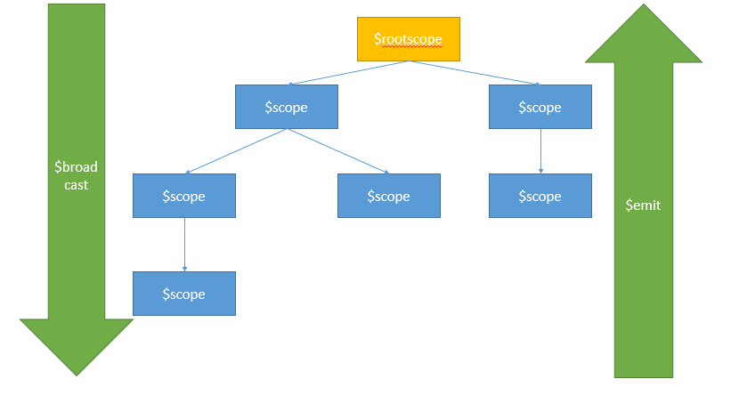

> 最近做不同controller之间的调用，用到了事件广播，顺便总结一下。

最近在开发过程中使用AngularJs，由于业务需求，需要使用A的controller调用B的controller中的方法。想到了在A中使用`$rootScope.$broadcast(name,args)`进行广播，在B中使用`$scope.$on(name,function(event,data){})`进行监听并调用B中方法。顺便总结一下AngularJs的作用域以及作用域之间的通信（事件广播）。

- 场景：A的controller调用B的controller中的方法

  - A中代码

    ```js
    //第一个参数是广播名，后面的参数是一些传参args
    //注意要用全局scope调用-->$rootScope
    //需要依靠其他事件（如ng-click等）进行触发
    $rootScope.$broadcast('judge', '1');
    ```

  - B中代码

    ```javascript
    //同样适用全局scope调用-->$rootScope
    //广播名judge对应上即可
    //$scope.changePwd();就是B中的一个方法
    $scope.$on('judge', function (event, data) {
    	$scope.changePwd();
    });
    ```

##### 一、作用域（父子作用域、兄弟作用域）

- AngularJs中的作用域（`$scope`）结构和DOM结构非常相似，也是一个层次分明的树状结构。它有一个根作用域`$rootscope`（对应Angular应用或者ng-app），其他作用域是嵌套在根作用域下面的。不同的作用域之间是相互隔离的，通过常规手段是无法互相访问变量及方法的。

- AngularJs的`$scope`之间都遵循js中对象原型继承方式，当子作用域中没有该对象时，默认向上级作用域（父作用域）寻找，直到找到或者到达`$rootscope`为止，当子作用域有该对象时，使用子作用域中的对象。（注：这里的父作用域包含直接父级和祖先，子作用域包含直接子级和更下层级）

- 例子：

  - 例子一：

    ```html
    <body ng-app="myApp">
        <div ng-controller="fatherCtrl">
            <input type="text" ng-model="name" ng-change="nameOnChange()">
            <h1>Father: {{name}}!</h1>
            <div ng-controller="sonCtrl">
                 <input type="text" ng-model="name" ng-change="nameOnChange()"> 
                 <h1>Son: {{name}}</h1>
            </div>
        </div>
    </body>
    ```

    其中fatherCtrl 和 sonCtrl 里都使用了 name，但sonCtrl中并没有定义name。

    ```javascript
    var app = angular.module ('myApp', []);
        app.controller('fatherCtrl', function ($scope) {
            $scope.name = "father";
            $scope.$watch("name",function () {
                console.log("fatherScope:"+$scope.name)
            })
    
        });
        app.controller('sonCtrl', function ($scope) {
            $scope.$watch("name",function () {
                console.log("sonScope:"+$scope.name)
            })
        });
    ```

    这时sonCtrl 直接读取 fatherCtrl 中的 name，改变fatherCtrl中name的值，sonCtrl显示的值也会同步改变。

    但当通过view同步改变sonCtrl中name的值时，sonCtrl中会重新创建一个name的对象，faterCtrl中的值不会改变。 

  - 例子二：

    - 1.父子作用域

    ```html
    <div ng-controller="ParentCtrl">
        <div ng-controller="ChildCtrl"></div>
    </div>
    ```

    当我们的controller层级关系是这种时，ChildCtrl就是子controller,ParentCtrl就是父controller，他们之间的作用域关系就是父子作用域。

    ```javascript
    app.controller("ParentCtrl", [ '$scope', function($scope){
        $scope.title = "I'm the Parent.";
     }]);
    app.controller("ChildCtrl", [ '$scope', function($scope){
        $scope.title = "I'm the Child.";
     }]);
    ```

    此时父子controller中都有`$scope.title`这个变量，此时如果子controller想使用父作用域中的变量的话：

    ```javascript
    $scope.$parent.title="Get parent's title";
    ```

    如果反过来，父controller想访问子controller中的变量或方法的话：

    ```javascript
    $scope.$$childHead.title="Get the first child's title"; //得到第一个子作用域中的变量
    $scope.$$childTail.title="Get the last child;s title";//得到最后一个子作用域中的变量
    ```

    这里要特殊说一点，父controller可以有很多个子controller，但是一个子controller只能有一个父controller，一个controller可以有很多个兄弟controller。

    - 2.兄弟作用域

    ```html
    <div ng-controller="FirstCtrl"></div>
    <div ng-controller="SecondCtrl"></div>
    ```

    此时FirstCtrl和SecondCtrl是兄弟关系，如果在FirstCtrl中想访问SecondCtrl中的变量或方法的话：

    ```javascript
    $scope.$$nextSibling.title="Get little brother's title";
    ```

    如果在SecondCtrl中想访问FirstCtrl中的变量的话：

    ```javascript
    $scope.$$prevSibling.title="Get big brother's title";
    ```

##### 二、作用域之间的通信

- 1.如何在作用域之间通信？

  - 1.创建一个单例服务，然后通过这个服务处理所有子作用域的通信。 
  - 2.通过作用域中的事件处理通信。但是这种方法有一些限制；你并不能广泛的将事件传播到所有监控的作用域中。你必须选择是与父级作用域或者子作用域通信。 

- 2.`$on`、`$emit`和`$broadcast`使得event、data在controller之间的传递变的简单。 

  - 1.`$emit`：子传父，传递event与data；

    ```javascript
    $scope.$emit('name', 'args');
    ```

  - 2.`$broadcast`：父传子，传递event与data；

    ```javascript
    $scope.$broadcast('name', 'args');
    ```

  - 3.`$on`：监听或接收数据，用于接收event与data；

    ```javascript
    $scope.$on('name', function(event,data){});
    ```

    `$broadcast`、`$emit`事件必须依靠其他事件（ng-click等）进行触发。

    值得注意的是：以上事件的主语是` $scope`， 因为所有的事件其实都是作用在scope上的。 （一般`$broadcast`使用`$rootscope`调用）

    - 在`$on`的方法中的event事件参数，其对象的属性和方法如下:

      | **事件属性/方法**       | **功能性说明**                                               |
      | ----------------------- | ------------------------------------------------------------ |
      | event.targetScope       | 获取传播事件的作用域                                         |
      | event.currentScope      | 获取接收事件的作用域                                         |
      | event.name              | 传播的事件的名称                                             |
      | event.stopPropagation() | 阻止事件进行冒泡传播，仅在$emit事件中有效（即取消通过`$emit`触发的事件的进一步传播） |
      | event.preventDefault()  | 阻止默认事件的发生（preventDefault把defaultPrevented标志设置为true。尽管不能停止事件的传播，我们可以告诉子作用域无需处理这个事件。也就是说，可以安全地忽略他们。） |
      | event.defaultPrevented  | 布尔值。如果调用了preventDefault事件则返回true。             |

      `$on()`函数返回了一个反注册函数，我们可以调用它来取消监听器。

  - 3.`$on`、`$emit`和`$broadcast`详解：

    事件传播的方向示意图如下所示：

    

    - 1.`$emit`

      - 该服务贯穿作用域发出一个向上的事件，该事件的生命周期开始于emit被启动的地方，事件一直朝着根作用域传递，传递期间会通知那些注册在作用域上的监听器，在这期间，作用域中的监听器接收到通知，获取事件，但是不会注销事件，事件继续往下传播。 

        ```html
        <!DOCTYPE html>
        <html lang="en">
        <head>
            <meta charset="UTF-8">
            <title>Title</title>
            <script src="http://cdn.static.runoob.com/libs/angular.js/1.4.6/angular.min.js"></script>
        </head>
        <body ng-app="myApp">
        <div ng-controller="fatherCtrl">
            <!--fatherCtrl可以得到-->
            <input type="text" ng-model="name" ng-change="nameOnChange()">
            <h1>Father: {{name}}!</h1>
            <div ng-controller="sonCtrl">
                <!--sonCtrl可以得到-->
                <input type="text" ng-model="name" ng-change="nameOnChange()">
                <h1>Son: {{name}}</h1>
                <div ng-controller="innerCtrl">
                    <input type="text" ng-model="name" ng-change="nameOnChange()">
                    <h1>inner: {{name}}</h1>
                </div>
            </div>
            <div ng-controller="broCtrl">
                <!--broCtrl得不到-->
                <input type="text" ng-model="name" ng-change="nameOnChange()">
                <h1>brother: {{name}}</h1>
            </div>
        </div>
        
        <script>
            var app = angular.module('myApp', []);
            app.controller('fatherCtrl', function ($scope) {
                $scope.name = "father";
                $scope.$on('test', function (e, newName) {
                    $scope.name = newName;
                });
            });
            app.controller('sonCtrl', function ($scope) {
                $scope.name = "son";
                $scope.$on('test', function (e, newName) {
                    $scope.name = newName;
                });
            });
            app.controller('broCtrl', function ($scope) {
                $scope.name = "brother";
                $scope.$on('test', function (e, newName) {
                    $scope.name = newName;
                });
            });
            app.controller('innerCtrl', function ($scope) {
                $scope.name = "inner";
                $scope.nameOnChange = function () {
                    $scope.$emit('test', $scope.name);
                }
            });
        </script>
        </body>
        
        
        </html>
        ```

    - 2.`$broadcast `

      - 该服务发布一个向下的事件给作用域中的所有子节点，该事件的生命周期也是从broadcast被启动开始。下面的所有子作用域都会接收到通知。之后，事件向下传播，在这期间，作用域中的监听器接收到通知，获取事件，但是不会注销事件，事件继续往下传播。 

        ```html
        <!DOCTYPE html>
        <html lang="en">
        <head>
            <meta charset="UTF-8">
            <title>Title</title>
            <script src="http://cdn.static.runoob.com/libs/angular.js/1.4.6/angular.min.js"></script>
        </head>
        <body ng-app="myApp">
        <div ng-controller="fatherCtrl">
            <!--fatherCtrl得不到-->
            <input type="text" ng-model="name" ng-change="nameOnChange()">
            <h1>Father: {{name}}!</h1>
            <div ng-controller="sonCtrl">
                <input type="text" ng-model="name" ng-change="nameOnChange()">
                <h1>Son: {{name}}</h1>
                <div ng-controller="outCtrl">
                    <!--outCtrl可以得到-->
                    <input type="text" ng-model="name" ng-change="nameOnChange()">
                    <h1>out in son: {{name}}</h1>
                    <div ng-controller="innerCtrl">
                        <!--innerCtrl可以得到-->
                        <input type="text" ng-model="name" ng-change="nameOnChange()">
                        <h1>inner in out: {{name}}</h1>
                    </div>
                </div>
            </div>
            <div ng-controller="broCtrl">
                <!--broCtrl得不到-->
                <input type="text" ng-model="name" ng-change="nameOnChange()">
                <h1>brother: {{name}}</h1>
            </div>
        </div>
        
        <script>
            var app = angular.module('myApp', []);
            app.controller('fatherCtrl', function ($scope) {
                $scope.name = "father";
                $scope.$on('test', function (e, newName) {
                    $scope.name = newName;
                });
            });
            app.controller('sonCtrl', function ($scope) {
                $scope.name = "son";
                $scope.nameOnChange = function () {
                    $scope.$broadcast('test', $scope.name);
                }
            });
            app.controller('broCtrl', function ($scope) {
                $scope.name = "brother";
                $scope.$on('test', function (e, newName) {
                    $scope.name = newName;
                });
            });
            app.controller('innerCtrl', function ($scope) {
                $scope.name = "inner";
                $scope.$on('test', function (e, newName) {
                    $scope.name = newName;
                });
            });
            app.controller('outCtrl', function ($scope) {
                $scope.name = "out";
                $scope.$on('test', function (e, newName) {
                    $scope.name = newName;
                });
            });
        </script>
        </body>
        
        
        </html>
        ```

    - 3.`$on `

      - 该服务监听指定类型的事件，获取从emit或者broadcast发布的事件。 

    - 注意：

      - 1.如果在作用域中没有父子关系存在，可以在控制器中注入`$rootScope`、使用`$broadcast`服务向下传播事件（但这个慎用），但是不能通过`$emit`向上传播事件。
      - 2.在作用域中存在父子关系时，可以也仅可以由子控制器使用`$emit`服务向上传播事件，同时父作用域中的控制监听器可以注销事件。

<iframe type="text/html" width="100%" height="385" src="http://www.youtube.com/embed/gfmjMWjn-Xg" frameborder="0"></iframe>